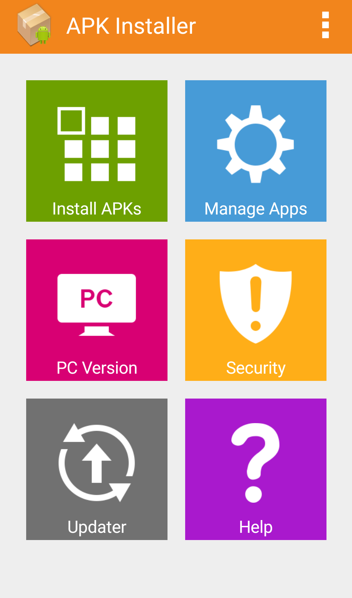
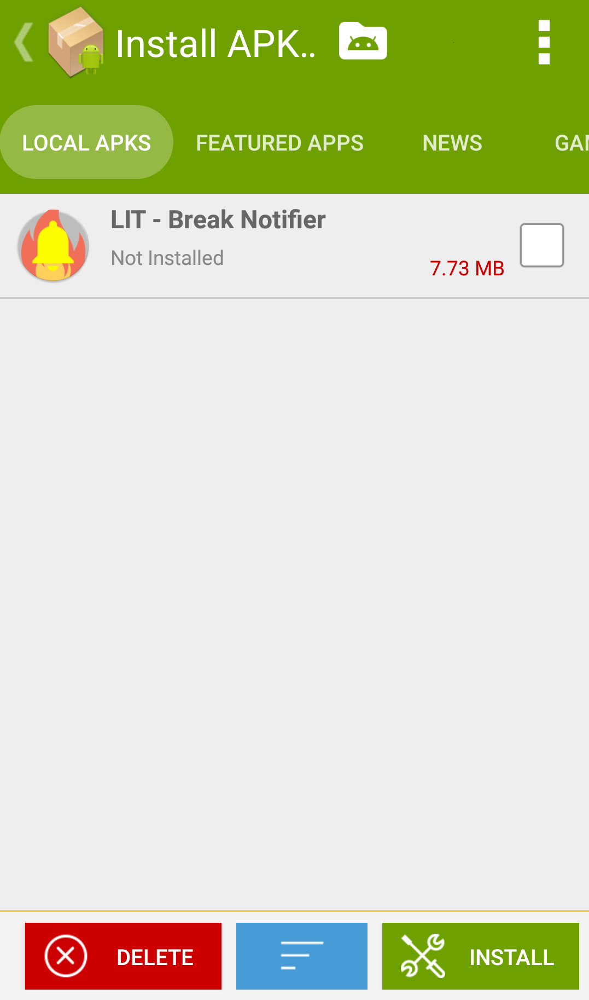

# BreakNotifier

## Projektwiki

# Überblick
    Diese App ist für die HTL-Leonding entwickelt, daher benötigt man einen WebUntis-Zugriff der Htl Leonding. 
    Die App benachrichtigt sobald eine Pause beginnt oder endet. 
    Weitere Informationen werden im Datailliertem Readme zur Verfügung gestellt.
    Dazu einfach auf den nachfolgenden Link drücken. 
Detaillierte Readme: https://davidweinberger.github.io/BreakNotifierAndroid/
    
    Die folgende Englische Installationsanleitung erläutert das einfach Installieren der App, 
    welche dann den standard Server verwendet. Jedoch nur das Installieren der Smartphone-App, 
    wenn Sie mehr erfahren möchten, wie Sie zum Beispiel selbst einen solchen Server hosten können. 
    Einfach der Anleitung im Detailliertem Readme folgen. 

##### Disclaimer: The following sections will be in English.

# Installing the .apk:

## 1. Download LIT-BN.apk
You should be able to find it in the root of the repository, right next to this README-file.

## 2. Open an APK installer of you choice
Installing .apk-files directly without one might not work for everyone, or Android inhibits it.

## 3. Select the correct file an hit "install"
You might have to fight your way through a couple of warnings as Android discourages installing apps from anywhere but the PlayStore.

# Attributions
- Background of the app icon (the flame-graphic):
    
Icons made by <a href="https://www.flaticon.com/authors/vectors-market" title="Vectors Market">Vectors Market</a> from <a href="https://www.flaticon.com/" title="Flaticon">www.flaticon.com</a>

